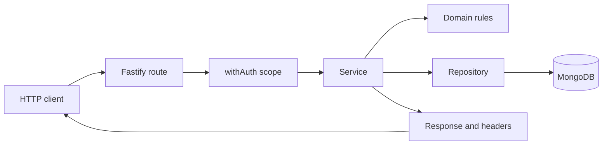
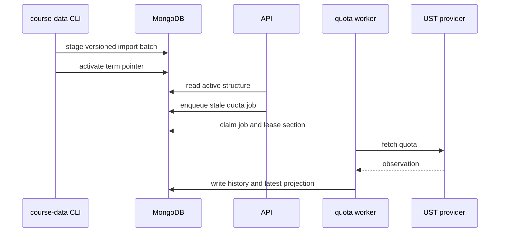

# Architecture

This is a read-heavy timetable backend. Requests mostly read; writes are comparatively rare and go through stricter checks. That imbalance is why the code is split the way it is.

Fastify autoloads the plugins and routes. An authenticated route hands the real work to a service, and the service pulls in two kinds of help: pure domain modules for validation and calculation, and repositories for anything that touches MongoDB.

## How a request moves

Each layer has one job:

- **`src/app.ts`** registers CORS, Swagger, Scalar, and the autoloaders.
- **`src/plugins/`** wires up MongoDB, the typed collections, auth, and shared helpers.
- **`src/routes/`** owns the HTTP surface: schemas, query parsing, status codes, auth scope, and response headers.
- **`src/services/`** orchestrates use cases. This is where a request turns into a sequence of steps.
- **`src/domain/`** holds the rules that do not need Fastify or MongoDB. Keeping it free of both is what makes it cheap to test.
- **`src/repositories/`** is where Mongo filters, projections, indexes, and owner/CAS boundaries live. If you are writing a query, it belongs here.

## Where academic data comes from

The CLI does all the provider work: fetch, normalize, validate, stage, activate. The API only ever reads the active batch, so a user request can never trigger a crawl of the UST site. That separation is deliberate, not incidental: the provider is slow and occasionally flaky, and no HTTP handler should depend on it.

Quota is the same idea on a smaller scale. When a quota read is stale or missing, the API returns whatever it has cached and queues one refresh job. It does not fetch inline. The worker owns the rest: leases, throttling, retries, and writing both the latest value and the history.

## Consistency boundaries

Events and plans belong to one owner. Both carry strong ETags over an integer revision, and both require `If-Match` on PATCH, DELETE, and auto-plan apply. The update is compare-and-set, so two clients editing the same plan cannot silently overwrite each other; the second one gets a `409` and has to re-read.

Idempotency records are scoped to the owner and the route, and they hash the request body. Replaying a key with the same body returns the stored response. Replaying it with a different body is a conflict.

Auto-plan generation is read-only. The signed option token records the plan revision plus the catalog, Common Core, quota, and calendar state it was built from. Apply verifies the token, re-reads all of that, checks conflicts again, and only then mutates the plan. A generated option is a proposal, not a reservation: an event imported after you generated it can invalidate it.

Sharing crosses a different boundary. A share token points at an expiring, revocable, sanitized snapshot rather than at your live plan. Discovery is opt-in and returns planning matches, not verified enrollment.

## Collections

| Collection | Purpose |
| --- | --- |
| `events`, `eventImports` | Manual events, effective ICS projections, and import manifests. |
| `idempotencyRecords` | Replay state, encrypted one-time secrets, and TTL cleanup. |
| `coursePlans`, `sharedPlans` | Reference-based plans and sanitized share snapshots. |
| `sectionDiscoverability`, `sharingRateLimits` | Opt-in aliases and short-lived rate limits. |
| `academicTerms`, `courses`, `courseOfferings`, `classSections`, `sectionBundles` | Versioned active-batch academic structure. |
| `quotaSnapshots`, `latestQuotas`, `refreshJobs`, `refreshLeases`, `importQuotaStaging` | Quota history, projection, queue, leases, and staged refresh results. |
| `courseWatches`, `watchNotifications`, `watchProjectionCheckpoints` | Watch definitions and asynchronous notifications. |
| `commonCoreCatalogs`, `commonCoreCatalogState` | Versioned Common Core data and active pointer. |
